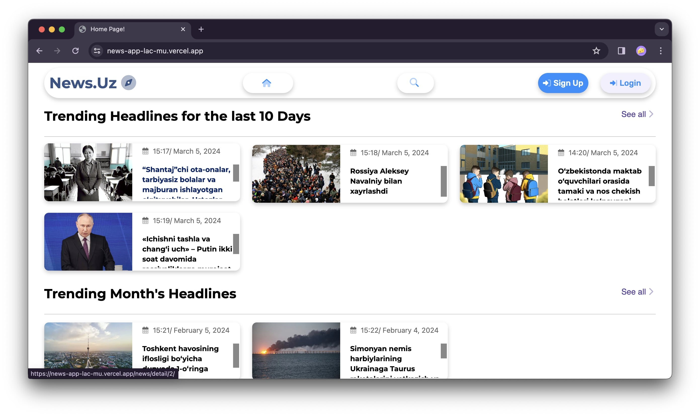
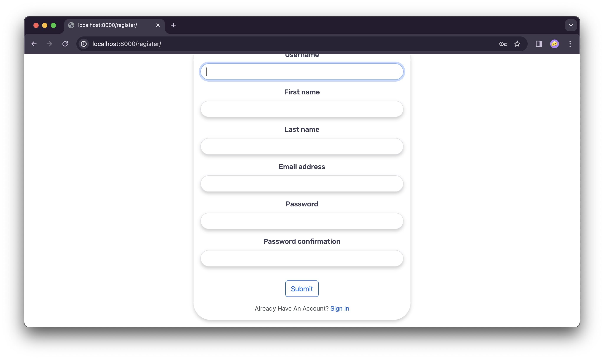
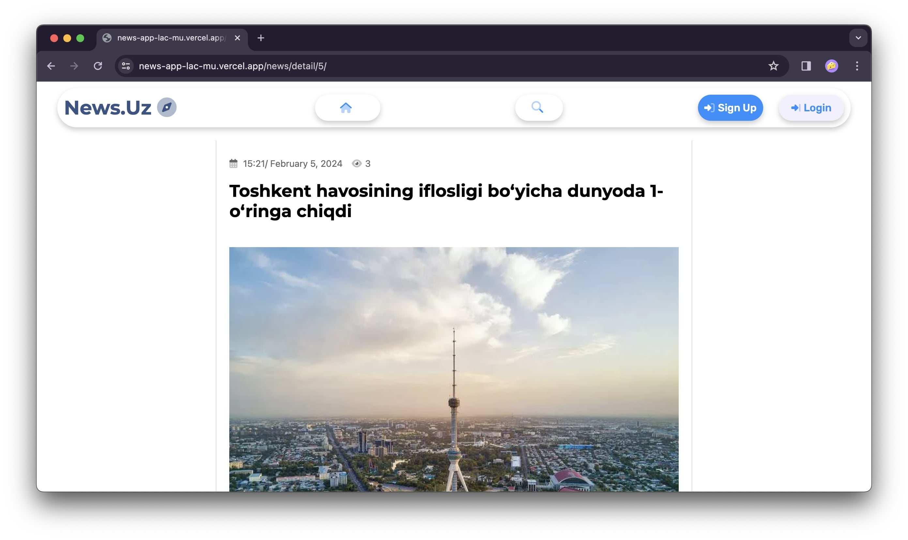
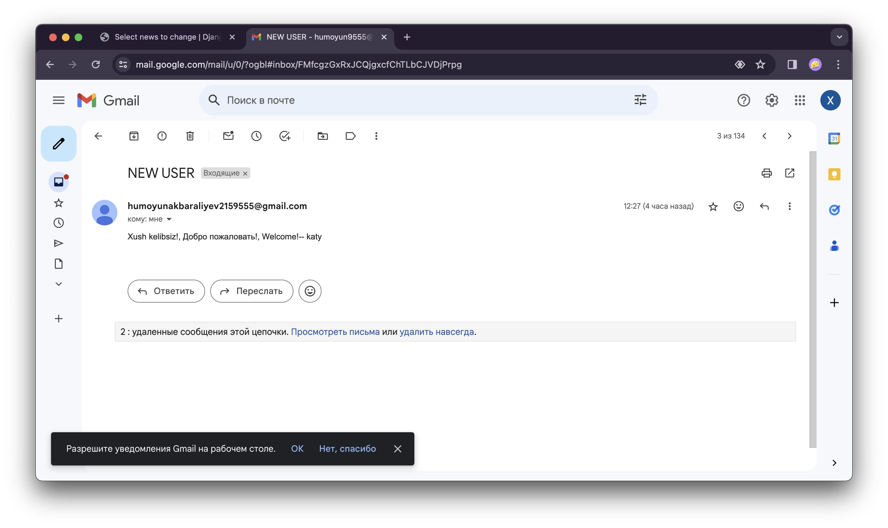

# News-App

> Этот проэкт для опубликования новостей, здесь читателям можно написать комментарии к новостям и читать новости 10 ти дневные и месяцные трендовые новости. Если они регистрацию проходять то к ним при каждой опубликовании новой новости приходить уведомление об новой новости и линк к этому новостю. И еще при регистрации к ним тоже приходить уведомление об приятного прихода. Сейчас программа `vercale` сервере есть через этот линк вы можете посмотерь - [news-app](https://news-app-lac-mu.vercel.app/).











**Пример программы так работает.**


## Установка pipenv

1. Убедитесь, что Python установлен на вашем компьютере.
2. Установите pipenv с помощью команды:
    ```
    $ pip install pipenv
    ```
3. Установите зависимости, запустив `pip install -r requirements.txt`

### Клонирование проекта и установка зависимостей

1. Клонируйте репозиторий:
    ```
    $ git clone https://github.com/Humoyun004/News_App.git
    ```
2. Заходите в репозиторий:
    ```
    cd News_App
    ```

3. Запустите команду `pipenv install`, чтобы создать виртуальное окружение и установить все зависимости из файла `Pipfile.lock`.

### Работа с проектом

- Для активации виртуального окружения запустите:
    ```
    pipenv shell
    ```
- Для установки новых зависимостей выполните:
    ```
    pipenv install <название_пакета>
    ```
- Чтобы запустить скрипты или приложение из вашего проекта, используйте `pipenv run`.


## Вклад
**Если вы хотите внести свой вклад в развитие приложения  пожалуйста, следуйте этим шагам:**

1. Форкните репозиторий на GitHub.
2. Клонируйте ваш форк репозитория на локальную машину.
3. Создайте новую ветку для вашей функции или исправления ошибки.
4. Внесите изменения и сделайте коммиты с описательными сообщениями.
5. Отправьте ваши изменения в ваш форк репозитория.
6. Создайте pull request (запрос на включение) в основной репозиторий.

## Контакты
**Если у вас есть вопросы или предложения относительно приложения, пожалуйста, свяжитесь с нами по адресу `humoyunakbaraliev1@gmail.com`. Мы ценим ваше мнение!**


